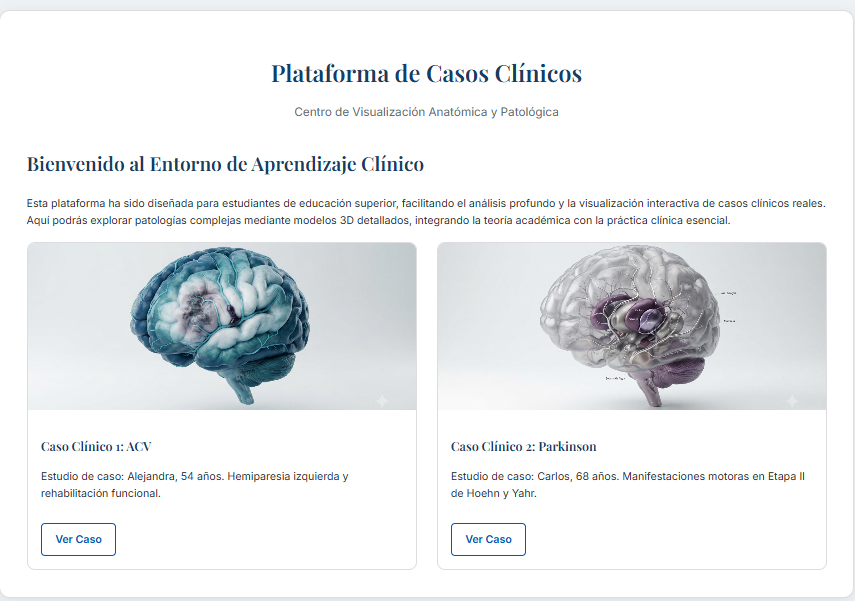
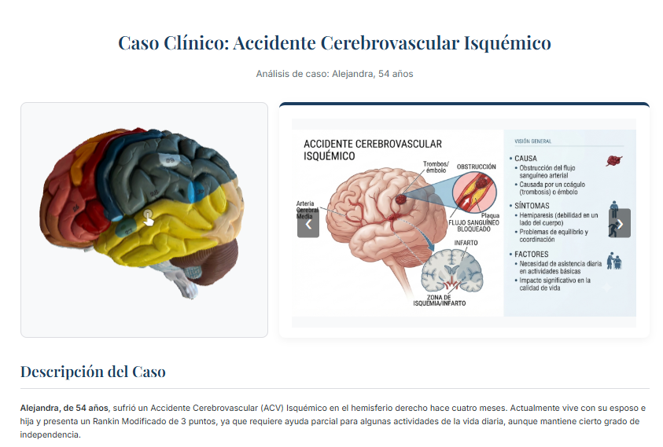
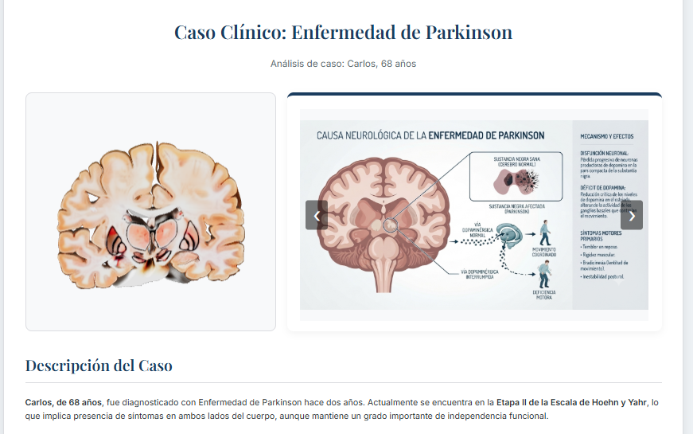

# 🩺 Plataforma Web de Casos Clínicos Interactivos & Visualización 3D

> **Plataforma web educativa para la salud y educación médica:** Interfaz inmersiva para el análisis de patologías complejas mediante renderizado de modelos anatómicos 3D interactivos, infografías secuenciales y diseño UI/UX responsive.


---

## 📌 Navegación Rápida
[← Volver al Portafolio Principal](https://camiloalarcon25.github.io/Mi_Portafolio_v1/) \| 🌐 **[Acceder al Sitio Web en Vivo](https://camiloalarcon25.github.io/Proyecto-Casos-Cl-nicos/)**

- [Vista General de la Plataforma](#-vista-general-de-la-plataforma)
- [El Desafío de Diseño y Propósito](#-el-desafío-de-diseño-y-propósito)
- [Arquitectura Frontend y Stack Tecnológico](#arquitectura)
- [Características Clave y Experiencia de Usuario](#-características-clave-y-experiencia-de-usuario)
- [Vistas Detalladas](#vistas)
- [Estructura del Proyecto](#-estructura-del-proyecto)
- [Recursos del Repositorio](#-recursos-del-repositorio)

---

## 📸 Vista General de la Plataforma

> *Experiencia de usuario optimizada para la exploración médica: navegación fluida por casos clínicos con visores 3D manipulables en tiempo real.*



*(Asegúrate de ajustar los nombres de las imágenes en tu carpeta de assets)*

---

## 🎯 El Desafío de Diseño y Propósito

El aprendizaje de patologías complejas (como un Accidente Cerebrovascular o la enfermedad de Parkinson) suele verse limitado por material de estudio bidimensional estático.

El objetivo de este desarrollo fue **crear una herramienta EdTech/MedTech interactiva y accesible desde el navegador** capaz de responder a necesidades clave:
1. **Visualización Anatómica Inmersiva:** Permitir al usuario manipular, rotar y hacer zoom sobre estructuras anatómicas tridimensionales (`.glb`) sin requerir plugins externos o software pesado.
2. **Navegación Secuencial e Intuitiva:** Organizar la información médica mediante carruseles dinámicos para guiar al estudiante paso a paso por la fisiopatología.
3. **Multi-Dispositivo sin Fricción:** Garantizar el rendimiento fluido tanto en ordenadores de escritorio como en smartphones/tablets.

---

## <a name="arquitectura"></a>🛠️ Arquitectura Frontend y Stack Tecnológico

El proyecto está desarrollado utilizando estándares web modernos para lograr máxima velocidad de carga y total independencia de frameworks pesados:

```text
[ Documentos HTML5 Semánticos ] ──( Modulos CSS3 / Grid & Flex )──> [ UI/UX Responsive ]
                                        │
                                        └──( Google Model-Viewer / WebGL )──> [ Renders 3D en Vivo ]
                                        │
                                        └──( JavaScript Vanilla )──> [ Carruseles & Control DOM ]
```

### 🧩 Especificación Técnica

| Capa / Herramienta | Tecnología | Función en la Plataforma |
| :--- | :--- | :--- |
| **Estructura** | HTML5 Semántico | Maquetación modular independiente por caso clínico (`index.html`, `acv.html`, `parkinson.html`) |
| **Estilos & Layout** | CSS3 (Flexbox & CSS Grid) | Diseño responsivo adaptativo, paleta cromática clínica y diseño tipográfico con Google Fonts (*Playfair Display* e *Inter*) |
| **Lógica e Interacción** | JavaScript (Vanilla ES6+) | Manipulación del DOM, eventos de usuario y control de carruseles informativos |
| **Renderizado 3D** | Google `<model-viewer>` | Integración de archivos `.glb` con controles orbitales de cámara, sombras y renderizado WebGL acelerado por GPU |

---

## 📈 Características Clave y Experiencia de Usuario (UI/UX)

* **Manipulación 3D en Tiempo Real:** Los modelos anatómicos permiten rotación 360°, zoom dinámico y reajuste de punto focal sin perder tasa de fotogramas.
* **Carruseles de Infografías Asíncronos:** Sistema de diapositivas para revisar el diagnóstico, síntomas y tratamiento secuencialmente.
* **Arquitectura de Carga Liviana:** Carga modular de assets y modelos 3D que previene el bloqueo de renderizado inicial (*First Contentful Paint*).
* **Adaptabilidad Móvil (Mobile First):** Ajuste automático de controles e interfaces táctiles para gestos de arrastre en teléfonos.

---

## <a name="vistas"></a>🖼️ Vistas Detalladas

<table width="100%">
  <tr>
    <td width="50%" align="center">
      <b>Caso Clínico: ACV (Accidente Cerebrovascular)</b><br><br>
      
    </td>
    <td width="50%" align="center">
      <b>Caso Clínico: Enfermedad de Parkinson</b><br><br>
      
    </td>
  </tr>
</table>

---

## 📂 Estructura del Proyecto

El repositorio está organizado con una arquitectura limpia de archivos web:

```text
/
├── index.html          # Portal principal con el catálogo de casos clínicos
├── acv.html            # Módulo especializado: Accidente Cerebrovascular
├── parkinson.html      # Módulo especializado: Enfermedad de Parkinson
├── style.css           # Hoja de estilos globales, utilidades de Grid/Flex y Responsive UI
├── script.js           # Controlador Vanilla JS para carruseles e interactividad
└── assets/             # Modelos tridimensionales (.glb) e infografías médicas
```

## 📂 Recursos del Repositorio

* 🌐 **Plataforma Web Desplegada:** [Explorar Casos Clínicos en GitHub Pages](https://camiloalarcon25.github.io/Proyecto-Casos-Cl-nicos/)
* 📄 **Estructura Principal:** [index.html](https://github.com/CamiloAlarcon25/Proyecto-Casos-Cl-nicos/blob/main/index.html)
* 🎨 **Hojas de Estilo:** [style.css](https://github.com/CamiloAlarcon25/Proyecto-Casos-Cl-nicos/blob/main/style.css)
* 📜 **Lógica JavaScript:** [script.js](https://github.com/CamiloAlarcon25/Proyecto-Casos-Cl-nicos/blob/main/script.js)
